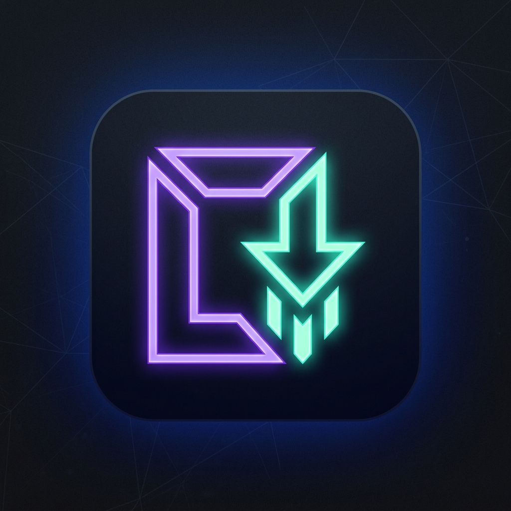
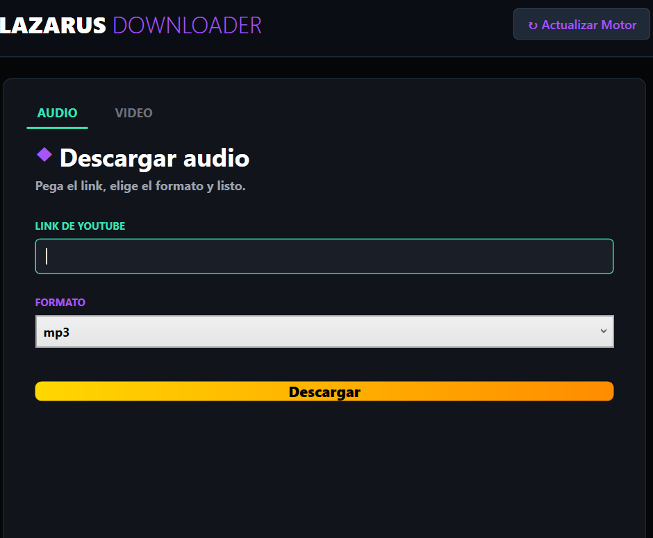
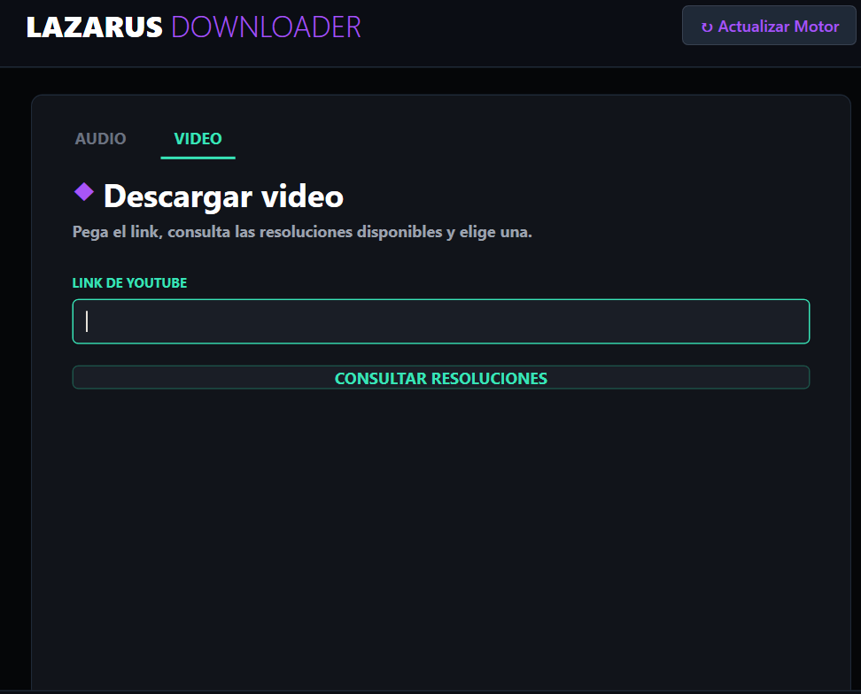

<div align="center">
  
  
  <h1 style="color: #A855F7; text-shadow: 2px 2px 5px rgba(168, 85, 247, 0.5);">🌌 LAZARUS DOWNLOADER YOUTUBE</h1>
  
  <p><strong>Descarga de Video y Audio en Calidad Extrema • Cyberpunk Edition</strong></p>
  
  <p>
    
    
    
  </p>
</div>

---

Una aplicación de escritorio moderna y de estética cyberpunk construida en **C# WPF** y **.NET 8**. Diseñada para descargar videos y audios de YouTube en la máxima calidad, saltándose las restricciones recientes mediante el uso de cookies de navegadores locales.

## 🚀 Características Principales

*   **Interfaz Cyberpunk (Lazarus Theme):** UI moderna, con animaciones fluidas, paleta oscura y detalles en colores neón (Cyan, Púrpura y Dorado).
*   **Descarga de Audio:** Extrae la mejor calidad en `MP3`, `FLAC` o `WAV`. Incrusta la portada (Thumbnail) y los metadatos automáticamente.
*   **Descarga de Video:** Consulta y extrae las resoluciones reales disponibles en los servidores (desde 144p hasta 4K) multiplexando el mejor audio y video.
*   **Bypass Anti-Bloqueos (Cookies):** Soporte nativo para evadir el Error 429 de YouTube inyectando de forma segura las cookies de tu navegador web preferido (Chrome, Firefox, Brave, Edge, Opera).
*   **Auto-Actualizador:** Botón integrado en la interfaz para descargar la versión más reciente del motor interno, manteniéndote siempre a prueba de los cambios en el código de YouTube.
*   **Gestión de Descargas Optimizada:** Barra de progreso que no congela la interfaz (UI Throttling) y botones de acceso directo a la carpeta de descarga.

---

## 🎨 Visuales (Lazarus Theme)

<div align="center">
  <h3>🎵 Descarga de Audio</h3>
  
  <p><i>Interfaz principal de descarga de música y extracción de portadas.</i></p>

  <br><br>

  <h3>🎬 Extracción de Video Inteligente</h3>
  
  <p><i>Explorador integrado de calidades y multiplexión automática a MP4/MKV.</i></p>
</div>

---

## 🛠 Arquitectura y Tecnologías

El proyecto fue estructurado utilizando el patrón de diseño **MVVM** (Model-View-ViewModel) para mantener el código desacoplado, testable y organizado.

*   **Plataforma:** .NET 8.0 (Windows Presentation Foundation)
*   **Patrón de Diseño:** MVVM implementado con `CommunityToolkit.Mvvm` (ObservableObject, RelayCommand).
*   **Motor Base de Extracción:** `yt-dlp` (El sucesor moderno de youtube-dl).
*   **Procesamiento Multimedia:** `FFmpeg` / `FFprobe` utilizados para conversiones de formatos y unión de canales (Multiplexión de Audio/Video en 1080p+).
*   **Desafíos JS (PoW):** Utiliza `Deno` como entorno de ejecución en segundo plano para descifrar las firmas de protección dinámicas de YouTube.
*   **Lenguaje:** C# 12

---

## 📥 Descarga y Uso Rápido (Usuarios)

**¡No necesitas instalar nada!** Esta aplicación es 100% portable.

1. Ve a la sección **[Releases](https://github.com/Ignaciofuen/Lazarus_Downloader_Ytb/releases)** (Lanzamientos) en la parte derecha de esta página.
2. Descarga el archivo más reciente (ej. `Lazarus_Downloader_v1.0.zip`).
3. Extrae la carpeta (`Clic derecho -> Extraer todo...`).
4. Abre la carpeta extraída y dale doble clic a **`YtdlpDesktop.exe`**.
*(Nota: No borres ni muevas los otros archivos `.exe` que vienen en la carpeta, el programa los usa en segundo plano para procesar tus descargas).*

---

## 📦 Compilación (Para Desarrolladores)

Si deseas clonar y compilar este proyecto tú mismo:

1. Clona el repositorio:
   ```bash
   git clone https://github.com/tu-usuario/YtdlpDesktop.git
   ```
2. Restaura los paquetes de NuGet (`CommunityToolkit.Mvvm`).
3. **Dependencias Críticas:** Para que el software funcione, debes descargar los siguientes ejecutables oficiales y pegarlos dentro de la carpeta de compilación final (ej. `bin/Release/net8.0-windows/`):
   *   `yt-dlp.exe`
   *   `ffmpeg.exe`
   *   `ffprobe.exe`
   *   `deno.exe`
4. Presiona **F5** en Visual Studio para iniciar el modo Debug, o publica el binario ejecutable final usando la terminal:
   ```bash
   dotnet publish -c Release
   ```

---

## 🖥 Modo de Uso

1. **Configura tu Navegador:** En la esquina inferior de la pantalla principal, selecciona el navegador web que utilizas para ver YouTube (ej. Firefox, Brave). Esto es vital para evitar los bloqueos anti-bot de la plataforma.
2. **Selecciona el Tipo:** Navega entre las pestañas `AUDIO` o `VIDEO`.
3. **Pega el enlace:** Pega la URL del video de YouTube en el campo de texto superior.
4. **Consulta calidades (Solo Video):** Pulsa "Consultar Resoluciones" para que el programa detecte todas las calidades y FPS disponibles.
5. **Descargar:** Haz clic en el formato o resolución que desees. La barra neón fluida te mostrará el progreso en tiempo real.
6. **Abre tu Archivo:** Al llegar al 100%, aparecerá un botón (`📁 Abrir archivo descargado`) que abrirá el explorador exactamente donde está tu archivo.

---

<div align="center">
  <i>Desarrollado con ❤️ para ofrecer una experiencia de descarga rápida, moderna y sin restricciones.</i>
</div>
